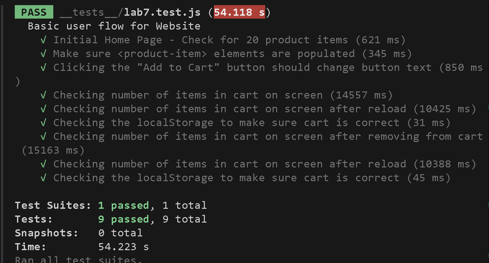

# Lab 7 - Unit & E2E Testing

## Team Members
- Sanggeon Jung (solo)

## Check Your Understanding

### 1) Where would you fit your automated tests in your Recipe project development pipeline?  
**Answer:**  
Within a Github action that runs whenever code is pushed 
This ensures that tests are run automatically during development and catch bugs early before merging into the main branch.

### 2) Would you use an end-to-end test to check if a function is returning the correct output?  
**Answer:**  
End-to-end tests are meant to simulate full user workflows through the UI, not for testing specific function outputs. Unit tests are better suited for that purpose.

### 3) What is the difference between navigation and snapshot mode?  
**Answer:**  
Navigation mode analyzes a page immediately after it fully loads and provides an overall performance score, but it cannot analyze content changes or user interactions.  
Snapshot mode analyzes the current static state of the page and is best used for accessibility checks. It cannot evaluate JavaScript performance or dynamic DOM changes.

### 4) Name three things we could do to improve the CSE 110 shop site based on the Lighthouse results.  
**Answer:**  

1. **Properly size images** - This potentially saves 566KiB.
2. **Add a `<meta name="viewport">` tag** - This improves mobile responsiveness
3.  **Add a meta description**  - This helps with search engine optimization(SEO) by making the page more understandable to crawlers.

## Test Results Screenshot

